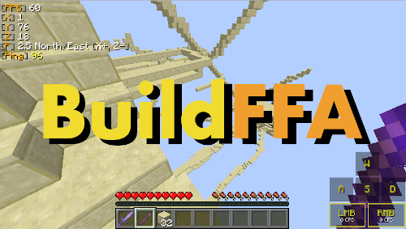

# BuildFFA
BuildFFA is a Free-For-All-Game plugin for Minecraft, where you drop on a map and you can use blocks.
You have to kick other players from the map or kill them.

It is compatible with Spigot and Bukkit (1.8.8/1.8.9). 
With Bukkit the plugin does not have all functionalities.

There will be a detailed README with version 1.0 of this plugin.
